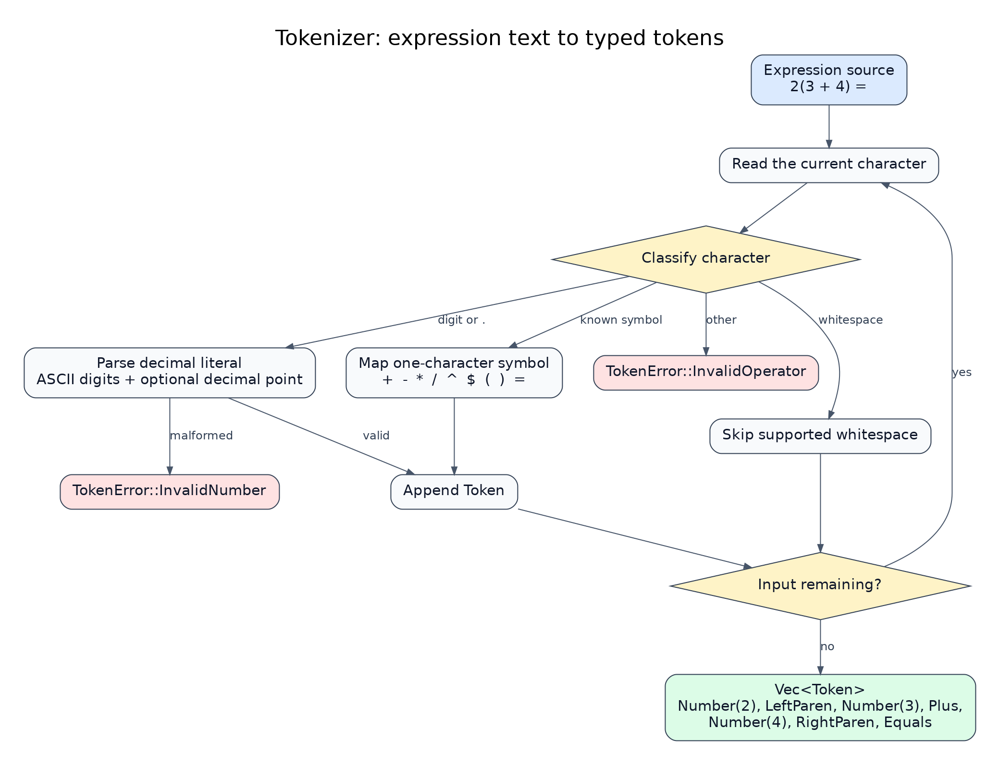
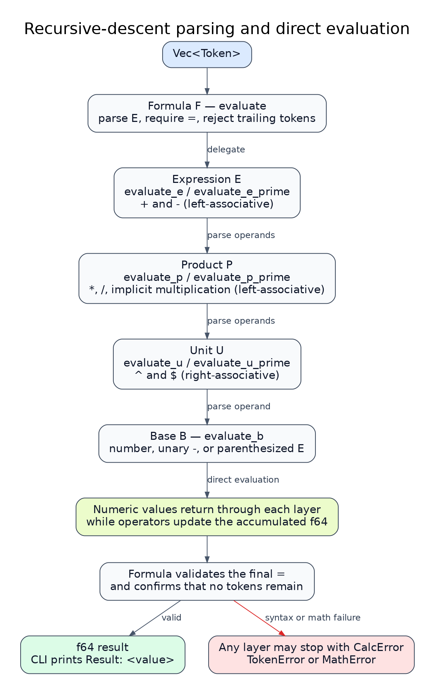

# Architecture

[← Documentation hub](../README.md) · [Grammar](grammar.md) · [Contributing](../../CONTRIBUTING.md)

CFG Parser uses a two-stage pipeline: lexical analysis converts source text into tokens, then a hand-written recursive-descent parser validates and evaluates the token stream.

## System flow

```text
CLI arguments ─┐
               ├─► input resolution ─► Tokenizer ─► Vec<Token> ─► MathExpressionParser
environment ───┤                                                    │
default input ─┘                                                    ├─► f64
                                                                    └─► CalcError
```

The runtime implementation currently lives in [`src/main.rs`](../../src/main.rs). Parsing and evaluation happen together: the parser computes numeric values while consuming tokens rather than constructing an abstract syntax tree.

## Components

| Component | Responsibility |
| --- | --- |
| `resolve_input_expression` | Select command-line input, `CFGPARSER_INPUT`, or the built-in demonstration expression. |
| `Token` | Represent numbers, operators, parentheses, and the `=` terminator. |
| `Tokenizer` | Convert source text into a `Vec<Token>`. |
| `MathExpressionParser` | Validate and evaluate tokens according to the grammar. |
| `TokenError` | Represent lexical and syntactic failures. |
| `MathError` | Represent invalid arithmetic operations and numeric failures. |
| `CalcError` | Unify parser and mathematical failures inside the evaluation pipeline. |
| `main` | Resolve input, run the pipeline, and expose the result through the CLI. |

## Design invariants

The implementation follows a few boundaries that keep the parser predictable:

- **Tokenization does not evaluate syntax.** It recognizes numbers and symbols only.
- **Precedence belongs to the parser.** Each precedence level maps to a dedicated grammar method.
- **Implicit multiplication is parser behavior.** No multiplication token is inserted by the tokenizer.
- **`=` terminates a formula.** It is not an arithmetic operator.
- **Parsing and evaluation are coupled.** Grammar methods return numeric values instead of syntax nodes.
- **CLI concerns stay outside the grammar.** Argument and environment resolution happen before tokenization.

The [grammar specification](grammar.md) is the canonical reference for language semantics, precedence, and associativity.

## Stage 1: tokenization

`Tokenizer` scans the input from left to right and produces a typed token stream.

It:

1. skips supported whitespace;
2. groups ASCII digits and a decimal point into `f64` number tokens;
3. maps supported one-character symbols to `Token` variants;
4. rejects malformed numbers and unsupported characters.

For example:

```text
2(3 + 4) =
```

becomes:

```text
Number(2)
LeftParen
Number(3)
Plus
Number(4)
RightParen
Equals
```

The tokenizer does not insert an implicit multiplication token between `2` and `(`. That relationship is interpreted later by the parser.

> [!NOTE]
> The language syntax is ASCII-oriented. The tokenizer advances by each character's UTF-8 width so unsupported Unicode input is rejected safely without leaving the scanner at an invalid byte boundary.



## Stage 2: parsing and evaluation

`MathExpressionParser` owns the token vector and tracks the current position within it.

Its methods mirror the grammar hierarchy:

| Layer | Methods | Responsibility |
| --- | --- | --- |
| Formula `F` | `evaluate` | Evaluate the expression, require `=`, and reject trailing tokens. |
| Expression `E` | `evaluate_e`, `evaluate_e_prime` | Addition and subtraction. |
| Product `P` | `evaluate_p`, `evaluate_p_prime` | Multiplication, division, and implicit multiplication. |
| Unit `U` | `evaluate_u`, `evaluate_u_prime` | Exponentiation and n-th roots. |
| Base `B` | `evaluate_b` | Numbers, unary negation, and parenthesized expressions. |

The hierarchy itself encodes precedence:

```text
Formula
   │
   ▼
Expression        + -
   │
   ▼
Product           * / implicit multiplication
   │
   ▼
Unit              ^ $
   │
   ▼
Base              number / unary - / (...)
```

Addition, subtraction, multiplication, and division update an accumulator, producing left-to-right evaluation within their precedence levels.

The unit layer recursively evaluates its right-hand side, making exponentiation and root operations right-associative.

Exact language behavior is documented in [Grammar](grammar.md).



## Direct evaluation

The parser evaluates expressions during traversal instead of producing an intermediate representation.

Conceptually, a product behaves like:

```text
parse first unit
      │
      ▼
 accumulator
      │
      ├─ parse next unit
      ├─ apply * / implicit multiplication
      ▼
 updated accumulator
      │
     ...
      ▼
     f64
```

This design keeps the original implementation compact and makes the grammar-to-code relationship easy to follow.

The trade-off is that there is no persistent representation of a parsed expression. An expression cannot currently be inspected, transformed, optimized, serialized, or evaluated again without parsing it again.

## Implicit multiplication

Implicit multiplication is resolved inside the product layer.

The tokenizer emits only the adjacent source tokens:

```text
Number(2), LeftParen, ...
```

The parser inspects those neighboring tokens and decides whether the adjacency represents multiplication.

Examples include:

```text
2(3 + 4)
(1 + 2)(3 + 4)
(1 + 2)3
2 3
```

The exact accepted transitions and their semantics are defined in [Grammar: implicit multiplication](grammar.md#implicit-multiplication).

## Error flow

Errors remain separated by responsibility:

```text
                     ┌─ lexical failure ─────► TokenError ─┐
source ─► Tokenizer ─┤                                     │
                     └─ tokens ─► Parser ──────────────────┤
                                                           ├─► CalcError
                              syntax failure ─► TokenError │
                                 math failure ─► MathError │
```

`Tokenizer::tokenize` returns `TokenError` directly.

Parser methods return `CalcResult`:

```rust
Result<f64, CalcError>
```

`From<MathError>` and `From<TokenError>` conversions allow parser methods to propagate both failure categories through `?`.

At the CLI boundary, `main` converts a successful result into printed output and returns failures to the process as errors.

Error text is intended for human diagnostics. It is not a stable machine-readable interface.

## Numeric model

All numeric values and intermediate calculations use IEEE 754 `f64`.

The evaluator explicitly handles cases including:

- division by zero;
- infinite arithmetic results;
- subnormal arithmetic results;
- invalid or non-finite exponentiation;
- invalid root operations over the supported real-number domain.

Normal floating-point rounding still applies.

Internal calculations retain the `f64` value, while successful CLI output is formatted to three decimal places.

For language-level root and exponentiation rules, see [Grammar](grammar.md).

## Input boundary

Expression input is resolved before tokenization.

The precedence is:

```text
command-line arguments
        │
        ▼
CFGPARSER_INPUT
        │
        ▼
built-in demonstration expression
```

Once an expression has been selected, the tokenizer and parser do not know where it came from.

This keeps input acquisition separate from language processing and allows the parser behavior to remain identical across CLI and environment-based input.

See [CLI usage](usage.md) for the public input contract.

## Test boundaries

The project verifies behavior at two levels.

### Parser and tokenizer tests

Unit tests colocated with the implementation exercise the internal language pipeline, including:

- tokenization;
- precedence and associativity;
- unary negation;
- parentheses;
- implicit multiplication;
- exponentiation and roots;
- malformed expressions;
- mathematical failures;
- error formatting.

### CLI integration tests

[`tests/cli.rs`](../../tests/cli.rs) executes the compiled binary as a separate process.

These tests verify behavior outside the parser itself, including:

- command-line input;
- multi-argument input;
- environment input;
- input-source precedence;
- default input;
- successful output;
- failure exit status.

Keeping both levels prevents CLI behavior from being inferred only from parser unit tests.

## Changing the parser

A language change normally affects several surfaces.

When adding or changing syntax:

1. update `Token` and tokenization when a new lexical symbol is required;
2. update the appropriate grammar production;
3. implement the behavior in the corresponding parser layer;
4. add or refine error variants when necessary;
5. add positive, precedence, boundary, and failure tests;
6. update the canonical language documentation.

Keep precedence decisions inside the narrowest applicable grammar layer.

Avoid implementing arithmetic syntax in `main`, input resolution, or other CLI-specific code.

## Current boundaries

Current architectural boundaries include:

- all runtime components are colocated in `src/main.rs`;
- the project is exposed as a binary rather than a reusable Rust library;
- parsing and evaluation are coupled;
- no AST or other intermediate representation is produced;
- one process evaluates one expression;
- input comes from arguments, the environment, or the built-in fallback rather than stdin.
